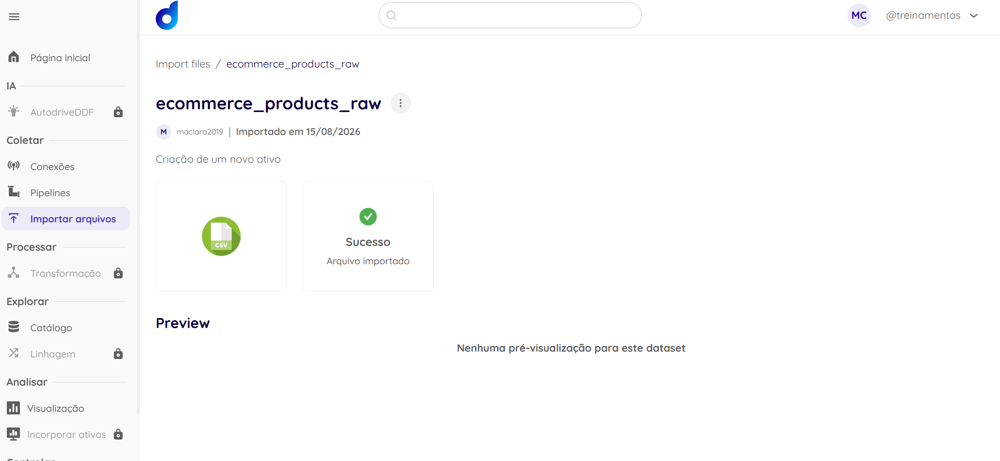
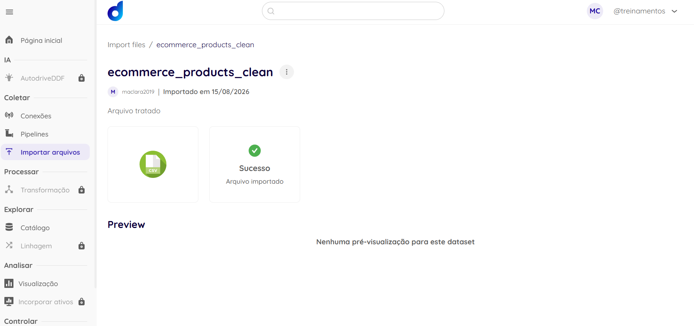

# MARIA_CLARA_DDF_TECH_082026

## Case Técnico — Dadosfera

**Candidata:** Maria Clara Silva  
**Processo seletivo:** Case Técnico — Analista de Dados  
**Data:** Agosto de 2026

---

# Apresentação do Case

A apresentação em vídeo não foi realizada devido à indisponibilidade de
tempo para gravação dentro do prazo de entrega.

As etapas desenvolvidas no case estão documentadas neste repositório,
com os respectivos códigos, resultados e evidências dos ativos
disponibilizados na Dadosfera.

---

# Item 1 — Ingestão e disponibilização dos dados

## Dataset RAW

O dataset utilizado no projeto contém dados de produtos de e-commerce,
incluindo informações de identificação, descrição, categoria, marca,
preço, avaliações, estoque e indicadores de vendas.

A camada RAW representa os dados em seu estado original, antes das etapas
de tratamento e validação.

**Características da base RAW:**

- Registros: **120.300**
- Colunas: **19**
- Formato: CSV
- Encoding: UTF-8

### Ativo na Dadosfera

[🔗 Acessar dataset RAW na Dadosfera](https://app.dadosfera.ai/pt-BR/collect/import-files/39ebcf6f-9706-4afa-b511-c0dc2948078a)

---

# Item 2 — Arquitetura e organização dos dados

O fluxo desenvolvido considera a separação entre os dados de origem
(RAW) e os dados tratados (CLEAN).

```text
                    ┌─────────────────────┐
                    │     Dataset RAW     │
                    │   120.300 registros │
                    └──────────┬──────────┘
                               │
                               ▼
                    ┌─────────────────────┐
                    │ Análise de qualidade│
                    │     Pandas + GX     │
                    └──────────┬──────────┘
                               │
                               ▼
                    ┌─────────────────────┐
                    │ Tratamento dos dados│
                    │                     │
                    │ • Duplicidades      │
                    │ • Nulos             │
                    │ • Valores inválidos │
                    │ • Estoque negativo  │
                    └──────────┬──────────┘
                               │
                               ▼
                    ┌─────────────────────┐
                    │    Dataset CLEAN    │
                    │   120.000 registros │
                    └─────────────────────┘
```

## Análise descritiva inicial

A análise exploratória inicial identificou:

- 120.300 registros;
- 19 campos;
- campos numéricos relacionados a preço, avaliação, estoque,
  visualizações, pedidos, unidades vendidas e receita;
- campos categóricos relacionados a categoria, subcategoria, marca,
  cor, localidade e tipo de vendedor;
- presença de valores nulos em `price`, `title` e `updated_at`;
- existência de duplicidades em `product_id`.

Essa análise inicial foi utilizada como base para a etapa posterior
de Data Quality.

---

# Item 3 — Catálogo e documentação dos dados

## Descrição do dataset

O dataset contém informações de produtos de e-commerce, abrangendo
características dos produtos, informações comerciais e indicadores
relacionados a vendas e estoque.

A base possui 19 campos:

| Campo | Descrição |
|---|---|
| `product_id` | Identificador do produto |
| `title` | Nome comercial do produto |
| `description` | Descrição textual do produto |
| `category` | Categoria principal do produto |
| `subcategory` | Subcategoria do produto |
| `brand` | Marca do produto |
| `color` | Cor do produto |
| `locale` | Localidade do produto |
| `seller_type` | Tipo de vendedor |
| `price` | Preço do produto |
| `rating` | Avaliação média do produto |
| `review_count` | Quantidade de avaliações |
| `stock_quantity` | Quantidade disponível em estoque |
| `views` | Quantidade de visualizações |
| `orders` | Quantidade de pedidos |
| `units_sold` | Quantidade de unidades vendidas |
| `revenue` | Receita associada ao produto |
| `created_at` | Data de criação do registro |
| `updated_at` | Data da última atualização |

## Ativos na Dadosfera

### Dataset RAW

[🔗 Acessar dataset RAW na Dadosfera](https://app.dadosfera.ai/pt-BR/collect/import-files/39ebcf6f-9706-4afa-b511-c0dc2948078a)

### Dataset CLEAN

[🔗 Acessar dataset CLEAN na Dadosfera](https://app.dadosfera.ai/pt-BR/collect/import-files/34cfbfd0-e867-4dd9-b9d5-9f6952e9c1b3)

## Evidências

### Dataset RAW



### Dataset CLEAN



O dicionário de dados também está disponível neste repositório:

[`docs/data_dictionary.csv`](docs/data_dictionary.csv)

---

# Item 4 — Data Quality

A qualidade dos dados da camada RAW foi analisada utilizando Python,
Pandas e Great Expectations.

O objetivo foi identificar problemas relacionados à completude,
unicidade e validade dos dados antes da disponibilização da camada CLEAN.

## Perfil inicial da base

- **Registros:** 120.300
- **Colunas:** 19

### Campos com valores nulos

| Campo | Registros nulos | Percentual |
|---|---:|---:|
| `price` | 502 | 0,42% |
| `updated_at` | 302 | 0,25% |
| `title` | 200 | 0,17% |

Os demais campos analisados não apresentaram valores nulos.

## Regras de qualidade

Foram utilizadas regras para verificar:

| Regra | Coluna | Resultado |
|---|---|---|
| Valores não nulos | `product_id` | PASS |
| Valores únicos | `product_id` | FAIL |
| Valores não nulos | `price` | FAIL |
| Valor dentro do intervalo esperado | `price` | PASS |
| Valor dentro do intervalo esperado | `rating` | FAIL |
| Valor válido | `stock_quantity` | FAIL |

## Problemas identificados

A análise detalhada identificou os seguintes problemas:

| Problema | Registros afetados |
|---|---:|
| `product_id` duplicado | 600 |
| `price` nulo | 502 |
| `rating` inválido | 300 |
| `stock_quantity` negativo | 250 |
| `title` nulo/vazio | 200 |
| `updated_at` nulo | 302 |

## Tratamento dos dados

Após a identificação dos problemas, foi realizada uma etapa de
tratamento da base para geração da camada CLEAN.

Entre os tratamentos realizados estão:

- remoção de registros duplicados;
- tratamento de valores nulos;
- tratamento de ratings fora do intervalo esperado;
- tratamento de valores negativos de estoque;
- tratamento de títulos ausentes;
- tratamento das datas `updated_at`.

## Resultado

A base RAW possuía **120.300 registros**.

Após o tratamento e a remoção das duplicidades, a camada CLEAN possui
**120.000 registros**.

```text
RAW
120.300 registros
      │
      ▼
Tratamento e validação
      │
      ▼
CLEAN
120.000 registros
```

### Registros removidos por duplicidade

**300 registros**

A camada CLEAN foi posteriormente validada pelas regras de qualidade
definidas.

## Arquivos relacionados

### Notebook

O código utilizado para análise, validação e tratamento dos dados está
disponível em:

[`notebooks/Item_4_Data_Quality_Dadosfera.ipynb`](notebooks/Item_4_Data_Quality_Dadosfera.ipynb)

### Dicionário de dados

[`docs/data_dictionary.csv`](docs/data_dictionary.csv)

### Relatório de Data Quality

O relatório de qualidade dos dados foi gerado a partir das validações
realizadas com Great Expectations sobre a camada RAW.

[`reports/data_quality_report.csv`](reports/data_quality_report.csv)

# Estrutura do projeto

```text
MARIA_CLARA_DDF_TECH_082026/
│
├── README.md
│
├── data/
│   ├── ecommerce_products_raw.csv
│   └── ecommerce_products_clean.csv
│
├── notebooks/
│   └── Item_4_Data_Quality_Dadosfera.ipynb
│
├── docs/
│   └── data_dictionary.csv
│ 
├── reports/
│   └── data_quality_report.csv
│ 
└── prints/
    ├── dadosfera_raw.png
    └── dadosfera_clean.png
```

---

# Tecnologias utilizadas

- Python
- Pandas
- Great Expectations
- Google Colab
- Dadosfera
- GitHub

---

# Observações

Os datasets utilizados no projeto foram disponibilizados na Dadosfera.

Os códigos e arquivos necessários para reproduzir as etapas realizadas
estão disponibilizados neste repositório.
